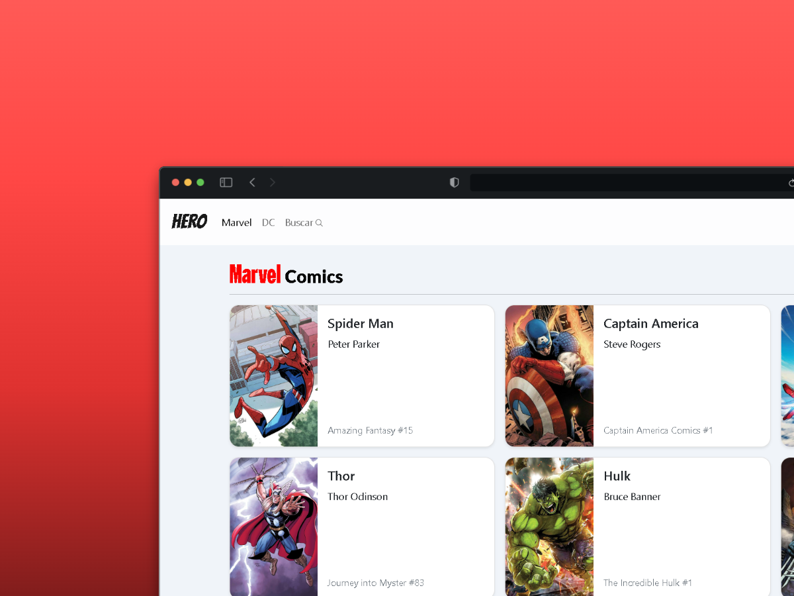

# HERO



## Descripción

HERO es una aplicación web interactiva que permite a los usuarios explorar y descubrir información sobre sus superhéroes favoritos de DC Comics y Marvel Comics. Esta aplicación ofrece una experiencia inmersiva para los aficionados de los cómics y los superhéroes, proporcionando un catálogo detallado y funciones de búsqueda intuitivas.

## Características principales

- **Catálogo de Superhéroes**: Presenta un extenso listado de superhéroes tanto de DC Comics como de Marvel Comics.

- **Filtrado por Publisher**: Los usuarios pueden filtrar los superhéroes por su editorial de origen (DC o Marvel), permitiendo una exploración más enfocada.

- **Búsqueda por Nombre**: Incluye una función de búsqueda que permite a los usuarios encontrar rápidamente superhéroes específicos por su nombre.

- **Tarjetas de Superhéroes**: Cada superhéroe se presenta en una tarjeta visualmente atractiva que muestra información básica del personaje.

- **Detalles Ampliados**: Al hacer clic en la tarjeta de un superhéroe, los usuarios son dirigidos a una página de detalles que proporciona información más completa, incluyendo:
  - Nombre del superhéroe
  - Primera aparición
  - Editorial (Publisher)
  - Alter ego

## Tecnologías Utilizadas

- React.js para la interfaz de usuario
- React Router para la navegación
- Bootstrap para el diseño responsive

## Cómo Usar

1. Navega por la lista completa de superhéroes en la página principal.
2. Utiliza los filtros para ver superhéroes específicos de DC o Marvel.
3. Usa la barra de búsqueda para encontrar un superhéroe por su nombre.
4. Haz clic en cualquier tarjeta de superhéroe para ver información detallada sobre ese personaje.

## Instalación
Sigue estos pasos para configurar y ejecutar el proyecto localmente.

### Prerrequisitos

Asegúrate de tener instalado [Yarn](https://yarnpkg.com/getting-started/install) en tu sistema.

### Instrucciones

1. Clona este repositorio:

    ```bash
    git clone https://github.com/dot-all/hero.git
    ```

2. Navega al directorio del proyecto:

    ```bash
    cd hero
    ```

3. Instala las dependencias necesarias:

    ```bash
    yarn install
    ```

4. Inicia el servidor de desarrollo:

    ```bash
    yarn dev
    ```

5. Abre tu navegador y navega a `http://localhost:3000` para ver el proyecto en acción.


## Contribuciones

Las contribuciones son bienvenidas. Por favor, abre un issue para discutir los cambios que te gustaría hacer.
